# Diagramas — PreVisar

Documentación visual del sistema. Refleja el estado actual del código en
`backend/src/main/java/ar/edu/utn/frc/previsar/` y `frontend/src/app/`.

> Los diagramas usan **Mermaid**. Se previsualizan en GitHub y en VS Code
> (vista previa de Markdown `Ctrl+Shift+V` + extensión _Markdown Preview Mermaid Support_).
> El esquema de base de datos (sección 7) se ve directamente en **dbdiagram.io**.

Contenido:

1. [Diagrama de clases (modelo de dominio)](#1-diagrama-de-clases--modelo-de-dominio)
2. [Arquitectura por capas](#2-arquitectura-por-capas)
3. [Mapa de componentes (cableado real)](#3-mapa-de-componentes--cableado-real)
4. [Flujos principales](#4-flujos-principales)
5. [Arquitectura del frontend](#5-arquitectura-del-frontend)
6. [Despliegue (Docker Compose)](#6-despliegue--docker-compose)
7. [Esquema de base de datos (DBML)](#7-esquema-de-base-de-datos-dbml)

---

## 1. Diagrama de clases — modelo de dominio

Entidades JPA y enums persistentes. Se divide en dos vistas para que sea legible:
el **núcleo** (cuenta, cartera y expediente) y los **satélites** del expediente
(estructura documental, validación, pagos y revisión externa).

### 1.1 Núcleo: cuenta, cartera y expediente

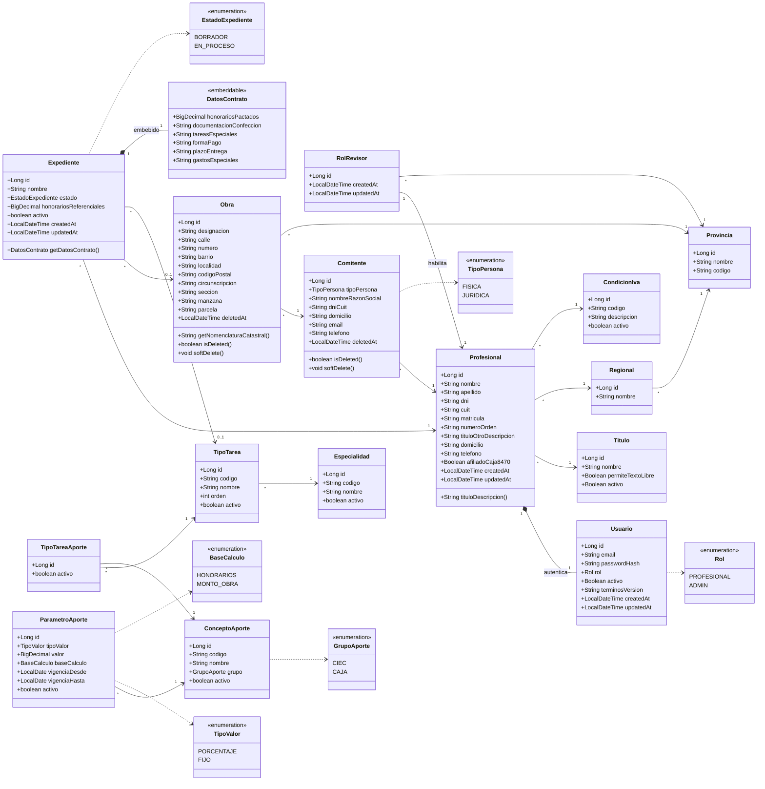

### 1.2 Satélites del expediente: estructura, documentos, validación y pagos

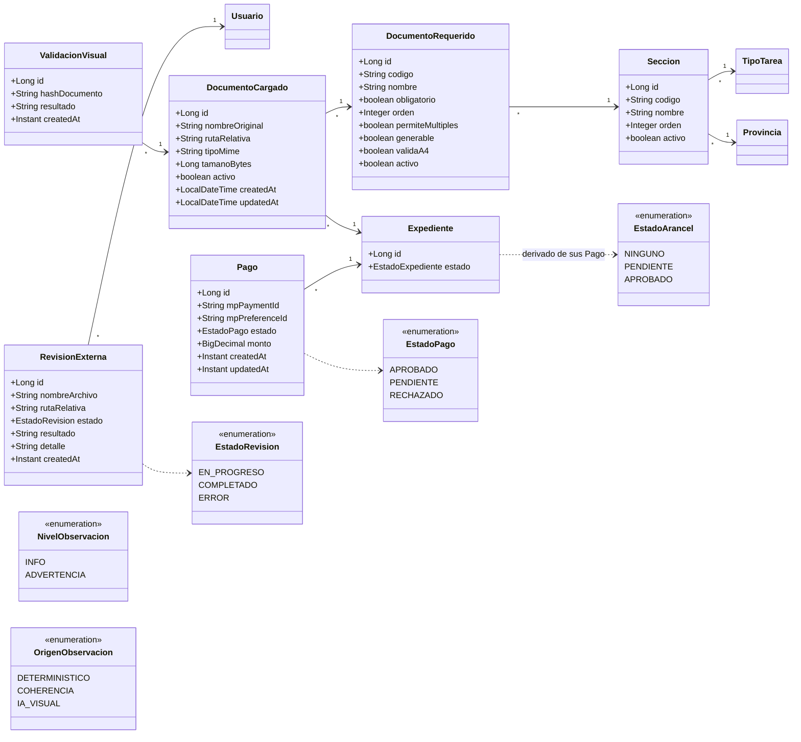

### Notas del modelo

- **Usuario ⇄ Profesional**: composición. Un `Profesional` _tiene_ un `Usuario`
  que lo autentica (`@OneToOne`). Los datos de login (email, hash, rol, versión de
  T&C aceptada) viven en `Usuario`; los datos personales/profesionales en
  `Profesional`.
- **RolRevisor**: rol secundario opcional. Si un `Profesional` tiene un
  `RolRevisor`, queda habilitado a administrar la estructura documental y el
  arancel de la `Provincia` indicada, y a usar el análisis de expedientes
  externos. _Revisor no es un valor del enum `Rol`._
- **Soft delete**: `Comitente` y `Obra` usan `deletedAt`; `Expediente` y
  `DocumentoCargado` usan un booleano `activo`. En ambos casos se preserva la
  integridad de los expedientes históricos.
- **Expediente**: en `BORRADOR` puede no tener `obra` ni `tipoTarea` todavía
  (ambas relaciones son nullable). `DatosContrato` es un `@Embeddable`: sus
  columnas viven en la tabla `expediente`, y el getter nunca devuelve `null`.
- **Aportes**: `ConceptoAporte` es el catálogo (grupo CIEC o CAJA),
  `TipoTareaAporte` declara qué conceptos aplican a cada tarea y
  `ParametroAporte` guarda el valor vigente de cada concepto. El resultado **no se
  persiste** en el expediente: se calcula on-demand.
- **EstadoArancel** no es una columna: se deriva de las filas de `Pago` con la
  prioridad `APROBADO > PENDIENTE > NINGUNO`.
- **Estructura documental**: `Seccion` + `DocumentoRequerido` se configuran por
  *(provincia, tipo de tarea)*. Los flags `generable`, `permiteMultiples` y
  `validaA4` son **dato**, no `if` en el código.
- **ValidacionVisual**: cachea el resultado de la IA por
  `(documento_cargado, hash de contenido)`. Si el archivo cambia, cambia el hash y
  se recalcula.
- **RevisionExterna** cuelga de `Usuario` (no de `Expediente`): es un PDF de un
  tercero que el revisor sube, ajeno a la cartera propia. Su estado vive en la
  base para sobrevivir un reinicio.

### Leyenda

| Notación               | Significado                                          |
| ---------------------- | ---------------------------------------------------- |
| `A *-- B`              | Composición (A contiene a B)                         |
| `A --> B`              | Asociación / referencia (`@ManyToOne` / `@OneToOne`) |
| `A ..> B`              | Dependencia (uso de un `enum`)                       |
| `"1"`, `"*"`, `"0..1"` | Multiplicidad de la relación                         |

---

## 2. Arquitectura por capas

El backend sigue una arquitectura clásica en capas: `Controller → Service → Repository`,
con DTOs en los bordes, mappers para la conversión entidad↔DTO, una capa de
seguridad transversal (JWT), integraciones con servicios externos y manejo
centralizado de excepciones.

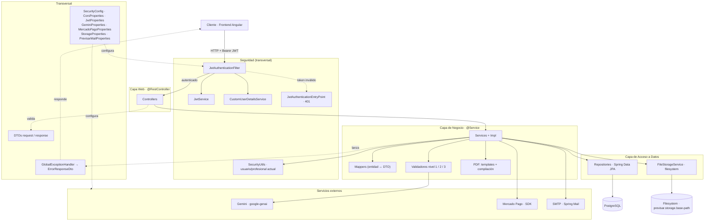

### Responsabilidades por capa

| Capa            | Componentes                                                                                                                                                          | Rol                                                                                                                          |
| --------------- | -------------------------------------------------------------------------------------------------------------------------------------------------------------------- | ---------------------------------------------------------------------------------------------------------------------------- |
| **Web**         | `AuthController`, `CatalogoController`, `ComitenteController`, `ObraController`, `ExpedienteController`, `DocumentoController`, `EstructuraController`, `ParametroAporteController`, `PagoController`, `RevisorController`, `ProfesionalController` | Exponen los endpoints REST, reciben/validan DTOs request y devuelven DTOs response.                                          |
| **Negocio**     | `*Service` (interfaz) + `*ServiceImpl` (`@Service`, `@Transactional`)                                                                                                | Lógica de negocio, validaciones y orquestación.                                                                              |
| **Validación**  | `ValidadorExpediente` ← `ValidacionNivel1Service`, `ValidacionNivel2Service`, `ValidacionNivel3Service`; orquesta `ValidacionServiceImpl`                             | Pre-validación por niveles. `ValidacionServiceImpl` inyecta la **lista** de validadores y fusiona sus resultados.             |
| **PDF**         | `PdfTemplate` ← `CaratulaTemplate`, `ContratoTemplate`; `PdfGenerationServiceImpl`, `CompilacionServiceImpl`, `PdfRasterizerService`, `PdfResponseFactory`, `NumeroALetras` | Generación de los PDFs propios, compilado del expediente y rasterizado para la IA.                                           |
| **Mappers**     | `ComitenteMapper`, `DocumentoCargadoMapper`, `EspecialidadMapper`, `EstructuraMapper`, `ExpedienteMapper`, `ObraMapper`, `ProfesionalMapper`, `TipoTareaMapper`      | Conversión entidad ↔ DTO (MapStruct, `componentModel = "spring"`).                                                            |
| **Datos**       | `*Repository` (Spring Data JPA), `FileStorageService`                                                                                                                | Persistencia sobre PostgreSQL; los archivos van al filesystem con validación anti *path traversal*.                          |
| **Integración** | `GeminiVisionClient`, `PagoMpService`, `EmailServiceImpl`                                                                                                            | Clientes de servicios externos, con timeouts, reintentos con backoff y degradación controlada.                               |
| **Seguridad**   | `SecurityConfig`, `JwtService`, `JwtAuthenticationFilter`, `JwtAuthenticationEntryPoint`, `CustomUserDetailsService`, `SecurityUtils`                                 | Autenticación stateless con JWT en cada request. La autorización de negocio (dueño del recurso, rol revisor) vive en los services. |
| **Transversal** | `GlobalExceptionHandler` + jerarquía de excepciones, DTOs, `CuitValidator`, `HashUtil`, `*Properties`                                                                 | Manejo de errores, validación y configuración externalizada (12-factor).                                                     |

### Jerarquía de excepciones → HTTP

| Excepción | HTTP | Cuándo |
|-----------|------|--------|
| `MethodArgumentNotValidException` | 400 | Falla `@Valid` en un DTO. |
| `BusinessException` | 400 | Regla de negocio violada. |
| `ForbiddenException` | 403 | Autenticado pero sin permiso (ej. no es revisor de esa provincia). |
| `ResourceNotFoundException` | 404 | Recurso inexistente **o ajeno**. |
| `BadCredentialsException` | 401 | Login incorrecto. |
| `DataIntegrityViolationException` | 409 | Choca con un `UNIQUE`/`CHECK`/FK de la base. |
| `GeminiException`, `PagoException` | 502 | Falla de un servicio externo. |
| `PdfGenerationException`, `StorageException` | 500 | Falla al generar un PDF o al leer/escribir un archivo. |
| `Exception` (catch-all) | 500 | Bug: se loguea el stacktrace. |

---

## 3. Mapa de componentes — cableado real

Dependencias inyectadas tal como están en el código. Los mappers se omiten del
grafo por claridad (cada service usa el suyo; se listan en la tabla de arriba).

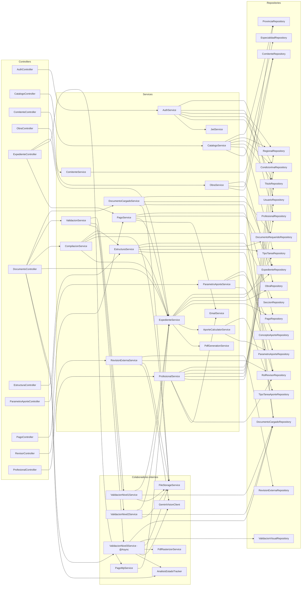

---

## 4. Flujos principales

### 4.1 Ciclo de vida del expediente

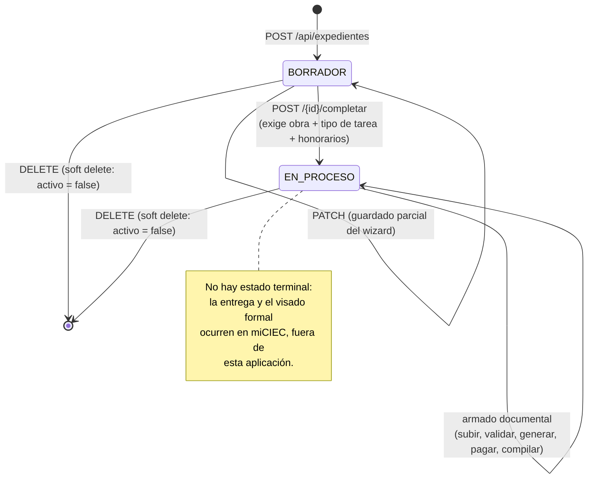

### 4.2 Pre-validación en 3 niveles

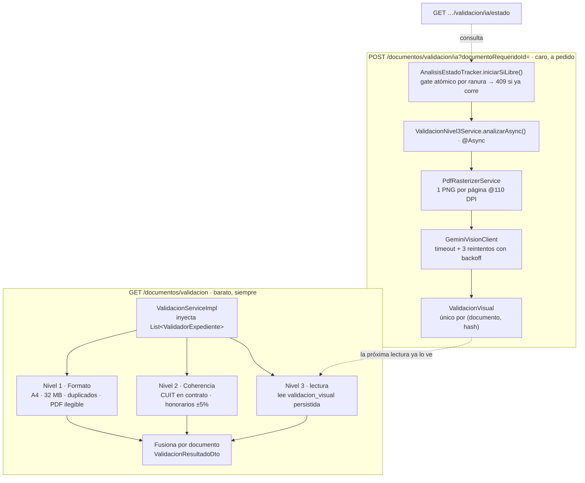

Observaciones: cada una lleva `codigo`, `NivelObservacion` (INFO / ADVERTENCIA) y
`OrigenObservacion` (DETERMINISTICO / COHERENCIA / IA_VISUAL). **Nada es
bloqueante**: PreVisar informa, no rechaza.

### 4.3 Pago del arancel (Mercado Pago)

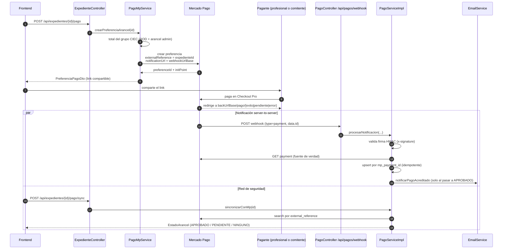

El `sync` existe porque el webhook puede perderse (túnel caído, URL vieja atada a
una preferencia anterior). Ambos caminos hacen el **mismo upsert idempotente**, así
que ejecutarlos N veces no duplica filas ni re-notifica.

### 4.4 Compilado del expediente

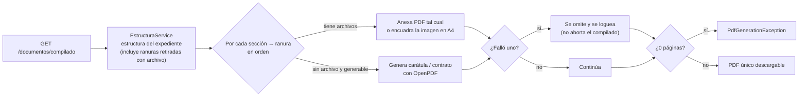

### 4.5 Revisión externa (rol revisor)

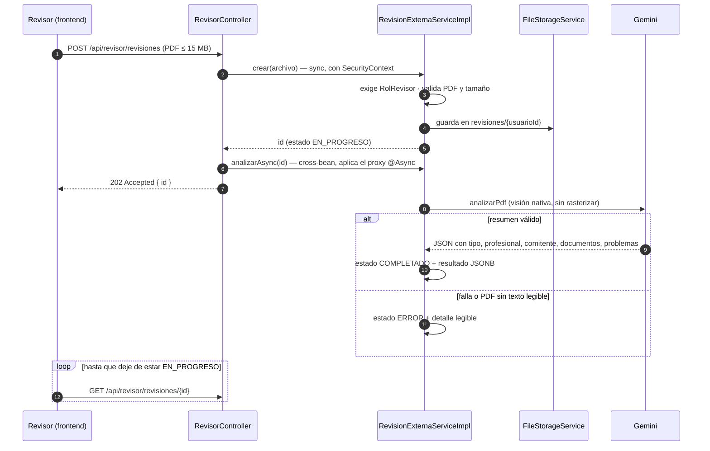

A diferencia del flujo del profesional (que arma ranura por ranura contra una
estructura conocida), acá la IA **solo describe lo que encuentra**: no sabe qué
debería haber, así que no juzga qué falta.

---

## 5. Arquitectura del frontend

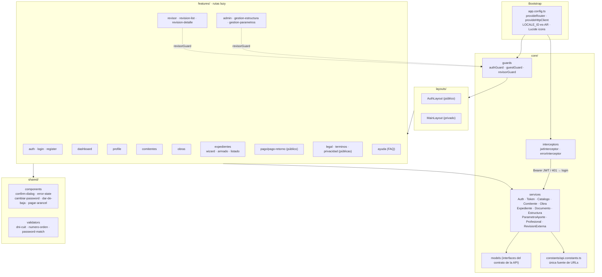

Decisiones: componentes **standalone**, **signals** para el estado local,
**interceptores funcionales**, rutas cargadas de forma **lazy** por feature y
**alias de path** (`@core`, `@shared`, `@features`, `@layouts`, `@env`) en lugar
de rutas relativas profundas.

---

## 6. Despliegue — Docker Compose

Las secciones anteriores describen cómo está organizado el código; esta describe
**cómo corre**. Todo el sistema se levanta con `docker compose up -d --build` y
queda en `http://localhost:4200`.

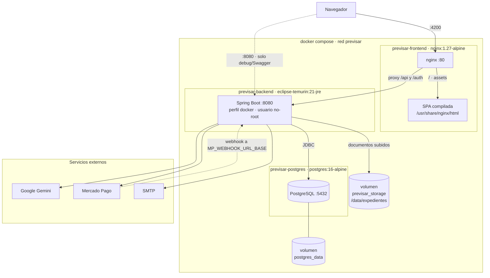

### Servicios

| Servicio | Imagen base | Puerto en el host | Estado persistente |
| -------- | ----------- | ----------------- | ------------------ |
| `frontend` | `nginx:1.27-alpine` | `4200 → 80` | — (estáticos en la imagen) |
| `backend` | build sobre `eclipse-temurin:21-jre` | `8080 → 8080` | volumen `previsar_storage` |
| `postgres` | `postgres:16-alpine` | `5432 → 5432` | volumen `postgres_data` |

Ambas imágenes propias son **multi-stage**: las herramientas de build (Maven+JDK,
Node) quedan en la primera etapa y no viajan a la imagen final, que lleva solo un
JRE o nginx.

### Decisiones del despliegue

- **nginx hace de reverse proxy, no solo de servidor de estáticos.** Redirige
  `/api` y `/auth` al backend, así que navegador y API quedan en el **mismo
  origen**. Es lo que permite que el build de producción use rutas relativas
  (`environment.ts`) y hace que **CORS no entre en juego** en este stack. El
  `:8080` se publica solo por comodidad (Swagger, pegarle directo a la API).
- **Orden de arranque encadenado por healthchecks**, no por `depends_on` a secas:
  `postgres` sano (`pg_isready`) → `backend` sano (`GET /api-docs`, que solo
  responde con el contexto de Spring levantado y las migraciones aplicadas) →
  `frontend`. Sin esto, Flyway podía arrancar contra una base que todavía no
  aceptaba conexiones, y nginx devolvía 502 en el primer ingreso.
- **Perfil `docker` separado del perfil `dev`.** `dev` apunta a
  `localhost:5432`, que dentro de un contenedor es el propio contenedor; el
  perfil `docker` resuelve la base por el nombre del servicio (`postgres`) y baja
  el logging de SQL.
- **Dos volúmenes con responsabilidades distintas**: `postgres_data` (la base) y
  `previsar_storage` (los documentos subidos). Sobreviven a `down` y a que se
  reconstruyan las imágenes; se borran solo con `down -v`. Es coherente con la
  decisión de que los archivos no van en la base: si el volumen se pierde, las
  rutas guardadas en `documento_cargado` quedan apuntando a la nada.
- **El backend corre como usuario sin privilegios** (`previsar`, uid 1001), y la
  carpeta del volumen le pertenece: si no, los uploads fallan con *permission
  denied*.
- **La falta de una credencial externa no impide arrancar.** Lo único
  obligatorio es `JWT_SECRET`. Si faltan las de Gemini, Mercado Pago o SMTP la
  aplicación levanta igual y falla solo esa función al invocarla, en vez de no
  arrancar: así se puede trabajar sin conexión o sin cuota. Con el `.env`
  completo —el **mismo** que usa el desarrollo local— todas las integraciones
  funcionan dentro de los contenedores como fuera.

> El **webhook de Mercado Pago** es la única entrada que no pasa por nginx: es
> una llamada server-to-server desde MP hacia `MP_WEBHOOK_URL_BASE`, que en local
> requiere un túnel público (`ngrok http 8080`). Ver el flujo en la
> [sección 4.3](#43-pago-del-arancel-mercado-pago).

---

## 7. Esquema de base de datos (DBML)

Esquema físico de la base, generado a partir de las migraciones Flyway
`V001`–`V030` (refleja el estado final).

**▶ Ver el diagrama en dbdiagram.io:**
https://dbdiagram.io/d/PreVisar-Esquema-de-base-de-datos-6a0db795b62396d22c2afed1

> ⚠️ El diagrama enlazado fue generado sobre `V001`–`V015`. Actualizarlo con las
> tablas incorporadas después: `concepto_aporte`, `tipo_tarea_aporte`, `seccion`,
> `documento_requerido`, `documento_cargado`, `validacion_visual`, `pago` y
> `revision_externa`.

### Notas del esquema

- **Estado final tras los `ALTER`**: `rol_revisor.provincia_id` se eliminó en
  `V008` y se restauró en `V010`; `profesional.titulo` (texto libre) se reemplazó
  por `titulo_id` (FK) + `titulo_otro_descripcion` en `V012`; `obra.provincia_id`
  se agregó en `V010`; `parametro_aporte.concepto` (VARCHAR) se reemplazó por
  `concepto_id` (FK) en `V017`; las 4 columnas `expediente.aporte_*` se eliminaron
  en `V018`.
- **Enums = `VARCHAR + CHECK`**: en Postgres no son tipos enum nativos; en el
  diagrama se representan como enumeraciones solo para documentar los valores
  válidos (`rol`, `tipo_persona`, `estado`, `grupo`, `tipo_valor`, `base_calculo`).
- **Índices parciales** (cláusula `WHERE`):
  - `comitente (profesional_id, dni_cuit)` solo entre activos (`WHERE deleted_at IS NULL`);
  - un único vigente por concepto en `parametro_aporte` (`WHERE vigencia_hasta IS NULL AND activo`);
  - `expediente` por `profesional_id` `WHERE activo`;
  - `seccion (provincia_id, tipo_tarea_id, codigo)` y
    `documento_requerido (seccion_id, codigo)` `WHERE activo` — así, al dar de baja
    lógica una sección o documento, su código queda libre para recrearse.
- **Índices únicos de idempotencia**: `pago (mp_payment_id)` evita que reprocesar
  un webhook duplique el pago; `validacion_visual (documento_cargado_id,
  hash_documento)` evita re-guardar el análisis del mismo contenido.
- **JSONB**: `validacion_visual.resultado` y `revision_externa.resultado` guardan
  la respuesta cruda de Gemini. Se persiste el JSON tal cual (no columnas) porque
  el esquema del modelo puede cambiar y el consumo es de lectura completa.
- **Relaciones 1:1** (`usuario`↔`profesional`, `profesional`↔`rol_revisor`):
  garantizadas por el `UNIQUE` en la FK.
- **`parametro_aporte`** no tiene FK a `tipo_tarea` a propósito: es configuración
  con vigencia temporal. Qué conceptos aplican a cada tarea lo declara
  `tipo_tarea_aporte`.
- **Los archivos no viven en la base**: `documento_cargado.ruta_relativa` y
  `revision_externa.ruta_relativa` apuntan al filesystem
  (`previsar.storage.base-path`). La baja de un documento es lógica en la base y
  *best-effort* en disco: no son transaccionales entre sí.
