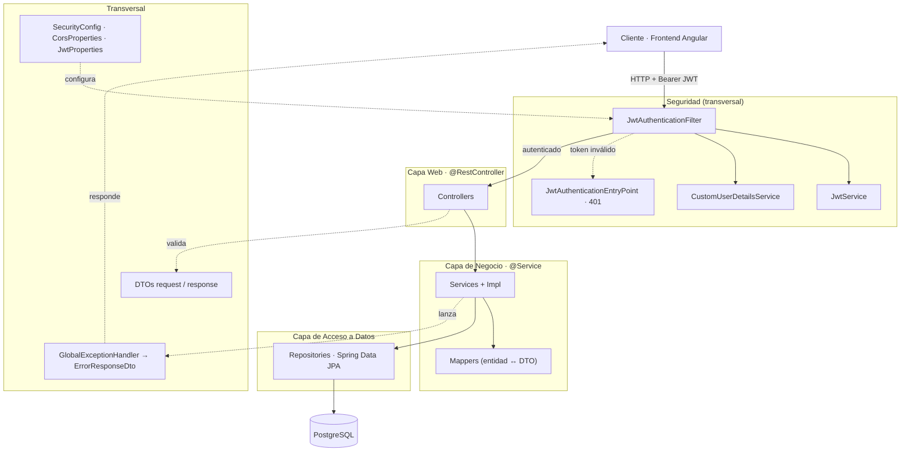
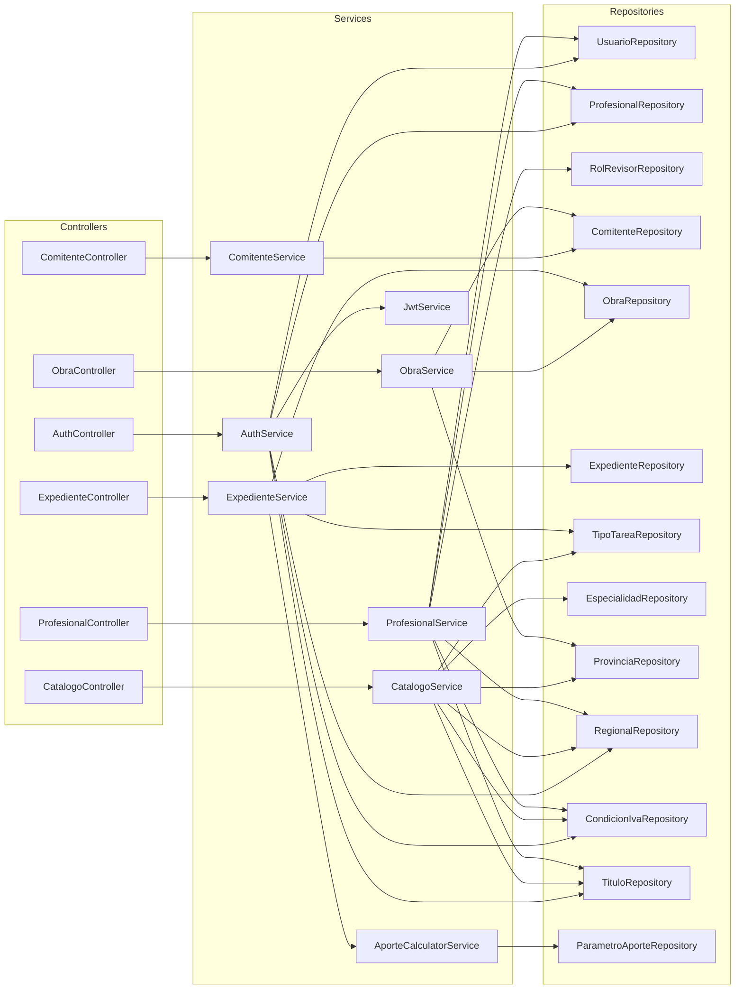

# Diagramas — Backend PreVisar

Documentación visual del backend Spring Boot. Refleja el estado actual del código
en `backend/src/main/java/ar/edu/utn/frc/previsar/`.

> Los diagramas usan **Mermaid**. Se previsualizan en GitHub y en VS Code
> (vista previa de Markdown `Ctrl+Shift+V` + extensión _Markdown Preview Mermaid Support_).
> El esquema de base de datos (sección 3) se ve directamente en **dbdiagram.io**.

Contenido:

1. [Diagrama de clases (modelo de dominio)](#1-diagrama-de-clases--modelo-de-dominio)
2. [Arquitectura por capas](#2-arquitectura-por-capas)
3. [Esquema de base de datos (DBML)](#3-esquema-de-base-de-datos--dbml)

---

## 1. Diagrama de clases — modelo de dominio

Entidades JPA y enums persistentes.

```mermaid
classDiagram
    direction LR

    %% ===================== Autenticación y profesional =====================
    class Usuario {
        +Long id
        +String email
        +String passwordHash
        +Rol rol
        +Boolean activo
        +LocalDateTime createdAt
        +LocalDateTime updatedAt
    }

    class Profesional {
        +Long id
        +String nombre
        +String apellido
        +String dni
        +String cuit
        +String matricula
        +String tituloOtroDescripcion
        +String domicilio
        +String telefono
        +Boolean afiliadoCaja8470
        +LocalDateTime createdAt
        +LocalDateTime updatedAt
    }

    class RolRevisor {
        +Long id
        +LocalDateTime createdAt
        +LocalDateTime updatedAt
    }

    %% ===================== Cartera del profesional =====================
    class Comitente {
        +Long id
        +TipoPersona tipoPersona
        +String nombreRazonSocial
        +String dniCuit
        +String domicilio
        +String email
        +String telefono
        +LocalDateTime createdAt
        +LocalDateTime updatedAt
        +LocalDateTime deletedAt
        +boolean isDeleted()
        +void softDelete()
    }

    class Obra {
        +Long id
        +String designacion
        +String calle
        +String numero
        +String barrio
        +String localidad
        +String codigoPostal
        +String circunscripcion
        +String seccion
        +String manzana
        +String parcela
        +LocalDateTime createdAt
        +LocalDateTime updatedAt
        +LocalDateTime deletedAt
        +String getNomenclaturaCatastral()
        +boolean isDeleted()
        +void softDelete()
    }

    class Expediente {
        +Long id
        +String nombre
        +EstadoExpediente estado
        +BigDecimal honorariosReferenciales
        +BigDecimal aporteRod
        +BigDecimal aporteArancelAdmin
        +BigDecimal aporteCajaProfesional
        +BigDecimal aporteCajaComitente
        +boolean activo
        +LocalDateTime createdAt
        +LocalDateTime updatedAt
    }

    %% ===================== Catálogos =====================
    class Especialidad {
        +Long id
        +String codigo
        +String nombre
        +boolean activo
    }

    class TipoTarea {
        +Long id
        +String codigo
        +String nombre
        +boolean aplicaRod
        +boolean aplicaArancelAdmin
        +boolean aplicaCaja
        +int orden
        +boolean activo
    }

    class Titulo {
        +Long id
        +String nombre
        +Boolean permiteTextoLibre
        +Boolean activo
    }

    class CondicionIva {
        +Long id
        +String codigo
        +String descripcion
        +boolean activo
    }

    class Provincia {
        +Long id
        +String nombre
        +String codigo
    }

    class Regional {
        +Long id
        +String nombre
    }

    class ParametroAporte {
        +Long id
        +ConceptoAporte concepto
        +TipoValor tipoValor
        +BigDecimal valor
        +BaseCalculo baseCalculo
        +LocalDate vigenciaDesde
        +LocalDate vigenciaHasta
        +boolean activo
    }

    %% ===================== Enums =====================
    class Rol {
        <<enumeration>>
        PROFESIONAL
        ADMIN
    }
    class TipoPersona {
        <<enumeration>>
        FISICA
        JURIDICA
    }
    class EstadoExpediente {
        <<enumeration>>
        BORRADOR
        EN_PROCESO
    }
    class ConceptoAporte {
        <<enumeration>>
        ROD
        ARANCEL_ADMIN
        CAJA_PROFESIONAL
        CAJA_COMITENTE
    }
    class TipoValor {
        <<enumeration>>
        PORCENTAJE
        FIJO
    }
    class BaseCalculo {
        <<enumeration>>
        HONORARIOS
        MONTO_OBRA
    }

    %% ===================== Relaciones (asociaciones) =====================
    Profesional "1" *-- "1" Usuario : autentica
    RolRevisor "1" --> "1" Profesional : habilita
    RolRevisor "*" --> "1" Provincia
    Profesional "*" --> "1" Titulo
    Profesional "*" --> "1" Regional
    Profesional "*" --> "1" CondicionIva
    Regional "*" --> "1" Provincia

    Comitente "*" --> "1" Profesional
    Obra "*" --> "1" Comitente
    Obra "*" --> "1" Provincia

    Expediente "*" --> "1" Profesional
    Expediente "*" --> "0..1" Obra
    Expediente "*" --> "0..1" TipoTarea
    TipoTarea "*" --> "1" Especialidad

    %% ===================== Dependencias con enums =====================
    Usuario ..> Rol
    Comitente ..> TipoPersona
    Expediente ..> EstadoExpediente
    ParametroAporte ..> ConceptoAporte
    ParametroAporte ..> TipoValor
    ParametroAporte ..> BaseCalculo
```

### Notas del modelo

- **Usuario ⇄ Profesional**: composición. Un `Profesional` _tiene_ un `Usuario`
  que lo autentica (`@OneToOne`). Los datos de login (email, hash, rol) viven en
  `Usuario`; los datos personales/profesionales en `Profesional`.
- **RolRevisor**: rol secundario opcional. Si un `Profesional` tiene un
  `RolRevisor` (relación `@OneToOne`), queda habilitado a revisar expedientes
  de la `Provincia` indicada. _Revisor no es un valor del enum `Rol`._
- **Soft delete**: `Comitente` y `Obra` no se borran físicamente; se marca
  `deletedAt` para preservar la integridad de expedientes históricos.
- **Expediente**: en estado `BORRADOR` puede no tener `obra` ni `tipoTarea`
  todavía (ambas relaciones son nullable). Los campos `aporte*` son un snapshot
  calculado a partir de los `ParametroAporte` vigentes.
- **Catálogos** (`Especialidad`, `TipoTarea`, `Titulo`, `CondicionIva`,
  `Provincia`, `Regional`): tablas de referencia precargadas vía Flyway.
- **ParametroAporte**: tabla parametrizable (con vigencia temporal) que alimenta
  el cálculo de aportes; se consulta por `concepto` + vigencia.

### Leyenda

| Notación               | Significado                                          |
| ---------------------- | ---------------------------------------------------- |
| `A *-- B`              | Composición (A contiene a B)                         |
| `A --> B`              | Asociación / referencia (`@ManyToOne` / `@OneToOne`) |
| `A ..> B`              | Dependencia (uso de un `enum`)                       |
| `"1"`, `"*"`, `"0..1"` | Multiplicidad de la relación                         |

---

## 2. Arquitectura por capas

El backend sigue una arquitectura clásica en capas: `Controller → Service → Repository`,
con DTOs en los bordes, mappers para la conversión entidad↔DTO, una capa de
seguridad transversal (JWT) y manejo centralizado de excepciones.

### 2.1 Flujo de una petición (vista conceptual)

### 2.2 Mapa de componentes (cableado real)

Dependencias inyectadas tal como están en el código (controllers → services →
repositories). Los `Mappers` se omiten del grafo por claridad (cada service usa
el suyo); se listan en la tabla de abajo.

### Responsabilidades por capa

| Capa            | Componentes                                                                                                                           | Rol                                                                                                                            |
| --------------- | ------------------------------------------------------------------------------------------------------------------------------------- | ------------------------------------------------------------------------------------------------------------------------------ |
| **Web**         | `*Controller` (`@RestController`)                                                                                                     | Exponen los endpoints REST, reciben/validan DTOs request y devuelven DTOs response.                                            |
| **Negocio**     | `*Service` (interfaz) + `*ServiceImpl` (`@Service`, `@Transactional`)                                                                 | Lógica de negocio, validaciones y orquestación. `ExpedienteService` delega el cálculo de aportes en `AporteCalculatorService`. |
| **Mappers**     | `ComitenteMapper`, `EspecialidadMapper`, `ExpedienteMapper`, `ObraMapper`, `ProfesionalMapper`, `TipoTareaMapper`                     | Conversión entidad ↔ DTO.                                                                                                      |
| **Datos**       | `*Repository` (Spring Data JPA)                                                                                                       | Persistencia sobre PostgreSQL.                                                                                                 |
| **Seguridad**   | `SecurityConfig`, `JwtService`, `JwtAuthenticationFilter`, `JwtAuthenticationEntryPoint`, `CustomUserDetailsService`, `SecurityUtils` | Autenticación stateless con JWT en cada request.                                                                               |
| **Transversal** | `GlobalExceptionHandler`, `BusinessException`, `ResourceNotFoundException`, DTOs, `CuitValidator`, `CorsProperties`, `JwtProperties`  | Manejo de errores, validación y configuración.                                                                                 |

> Estas dos vistas (conceptual y cableado real) documentan la **arquitectura de
> aplicación**; el modelo persistente está en la [sección 1](#1-diagrama-de-clases--modelo-de-dominio).

---

## 3. Esquema de base de datos (DBML)

Esquema físico de la base, generado a partir de las migraciones Flyway
`V001`–`V015` (refleja el estado final).

**▶ Ver el diagrama en dbdiagram.io:**
https://dbdiagram.io/d/PreVisar-Esquema-de-base-de-datos-6a0db795b62396d22c2afed1

### Notas del esquema

- **Estado final tras los `ALTER`**: `rol_revisor.provincia_id` se eliminó en
  `V008` y se restauró en `V010`; `profesional.titulo` (texto libre) se reemplazó
  por `titulo_id` (FK) + `titulo_otro_descripcion` en `V012`; `obra.provincia_id`
  se agregó en `V010`.
- **Enums = `VARCHAR + CHECK`**: en Postgres no son tipos enum nativos; en el
  diagrama se representan como enumeraciones solo para documentar los valores
  válidos (`rol`, `tipo_persona`, `estado`, `concepto`, `tipo_valor`, `base_calculo`).
- **Índices parciales** (cláusula `WHERE`): unicidad de `comitente`
  (`profesional_id, dni_cuit` solo entre activos, `WHERE deleted_at IS NULL`),
  un único vigente por `concepto` en `parametro_aporte`
  (`WHERE vigencia_hasta IS NULL AND activo`) e índice de `expediente`
  por `profesional_id` `WHERE activo`.
- **Relaciones 1:1** (`usuario`↔`profesional`, `profesional`↔`rol_revisor`):
  garantizadas por el `UNIQUE` en la FK.
- **`parametro_aporte`** no tiene FK a propósito: es configuración (con vigencia)
  que consume el cálculo de aportes.
